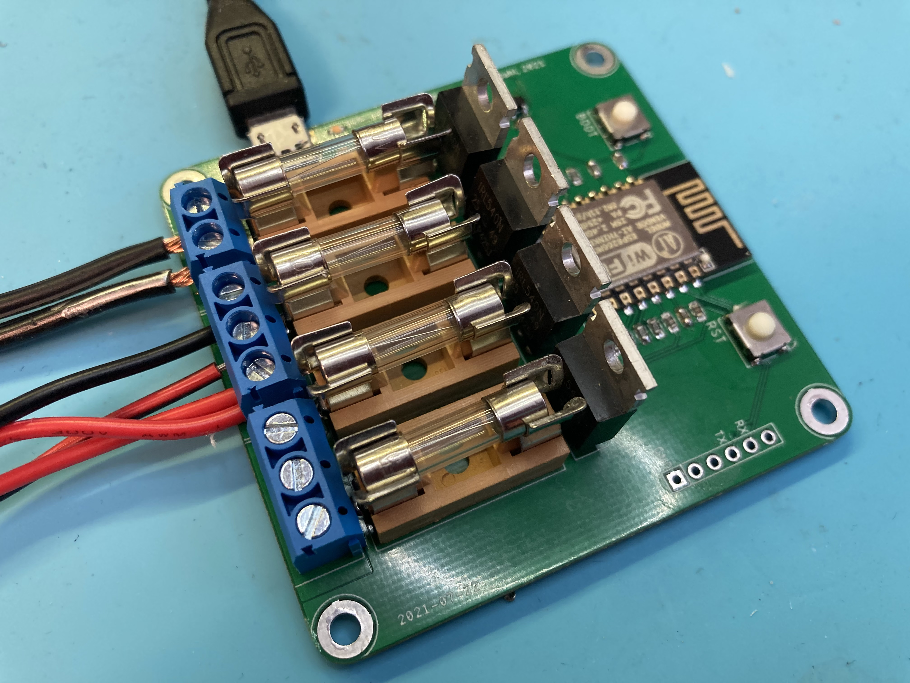

# ESP12_PwmBoard

This is a simple ESP-12 based 4 channel PWM board I designed to be used in Home Assistant. It is powered by 5V over a micro USB connector, and gives you 4 channels of PWM control, perfect to control analog  LED strips at 24 or 12 Volts. The screw connectors used are rated at maximum 15A, so you need to keep the _total_ combined power usage under that limit. The MOSFET's used are way overkill (100V/36A), they just happened to be what I had in stock.

I designed the board to be used with dual LED strips, warm and cold white, which gives you 2 channels with color temperature control in Home Assistant, but it can be used as a 4 channel PwM controller as well.

> NOTE: This PCB is NOT designed to be used for mains voltage!



## PCB files

I have added the Gerber files in the `PCB/Gerber` folder, just zip and upload to your favorite PCB manufacturer.

I have also included the EAGLE design files if you need to modify the design for yoyr needs.

## Firmware

I use ESPHome to set it up, which is the easiest way for it to show up in Home Assistant. 

Change the `esphome` section to this:

```
esphome:
  name: pwm1
  platform: ESP8266
  board: esp12e
```
Add the following section to add the PWM controls as 2 channels with cold/warm white lights in Home Assistant. Substitute the color temperature values for your LED strips.

```
output:
  - platform: esp8266_pwm
    pin: GPIO13
    id: output_pwm1_c
  - platform: esp8266_pwm
    pin: GPIO12
    id: output_pwm1_w
  - platform: esp8266_pwm
    pin: GPIO5
    id: output_pwm2_c
  - platform: esp8266_pwm
    pin: GPIO4
    id: output_pwm2_w
    
light:
  - platform: cwww
    name: "pwm1"
    cold_white: output_pwm1_c
    warm_white: output_pwm1_w
    cold_white_color_temperature: 4000 K
    warm_white_color_temperature: 3000 K
  - platform: cwww
    name: "pwm2"
    cold_white: output_pwm2_c
    warm_white: output_pwm2_w
    cold_white_color_temperature: 4000 K
    warm_white_color_temperature: 3000 K
    constant_brightness: true
```

### Flashing the board

You will need a USB-Serial adapter for initial upload of the firmware, and use the [ESPHome-Flasher](https://github.com/esphome/esphome-flasher) flashing utility.

 - Compile and download the firmware to your local machine.
 - Connect the serial adapter to the board, the board is designed for the pinout of standard FT232RL adapters.
 - Hold down the BOOT button, tap the RST button and then let go of RST. This puts the ESP-12 module in bootloader mode ready for firmware upload.
 - Start ESPHome-Flasher, select the firmware file and the proper COM port and click _Flash ESP_.

## Enclosure

...work in progress...